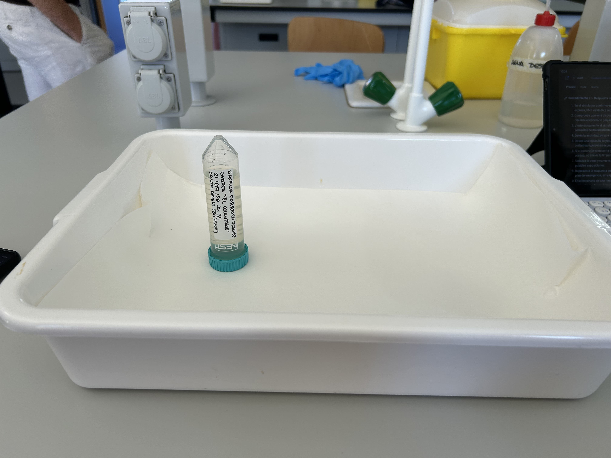
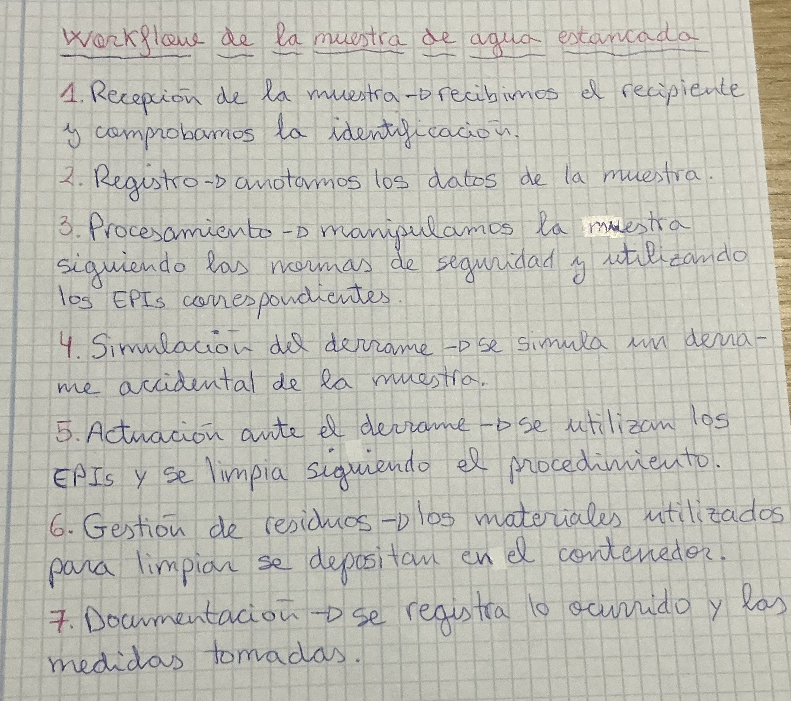
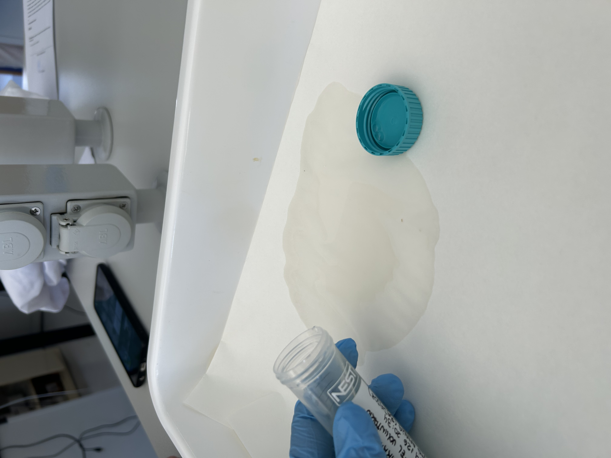
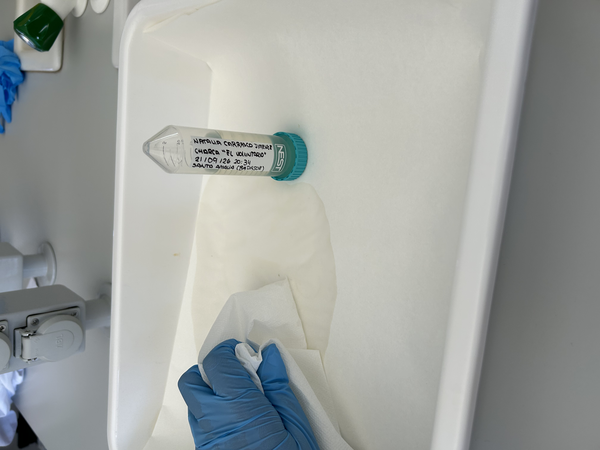

# P01 — Inducción de bioseguridad, riesgos, EPI, residuos y trazabilidad

> **Estado de esta página:** Completa individualmente los bloques **[ALUMNADO · RELLENABLE]** durante o después de la práctica. Si trabajas en pareja, puedes compartir las imágenes del proceso, pero tu registro, interpretación y reflexión deben ser personales.

## 1. Identificación de la práctica

| Campo | Información |
|---|---|
| Código y título | `P01 — Inducción de bioseguridad, riesgos, EPI, residuos y trazabilidad` |
| Unidad didáctica | `UD1 — La microbiología` |
| Resultado de aprendizaje | `RA01` |
| Criterios de evaluación | `CE01.a–CE01.i` |
| Modalidad prevista | Recepción simulada de una muestra líquida, simulación controlada de derrame y resolución individual del registro. |
| Modalidad de seguridad | La modalidad ordinaria utiliza simulante líquido no biológico y material limpio; no se manipulan muestras clínicas ni cultivos salvo autorización expresa del centro y procedimiento validado específico. |

## 2. Resumen

En esta práctica aprenderás a recibir una muestra líquida de forma segura y trazable y a responder ante un derrame simulado. Analizarás el espacio de recepción, la señalización y los peligros antes de seleccionar barreras y EPI. Con una muestra no biológica revisarás la documentación, la identificación, la integridad del envase y el acondicionamiento antes de aceptarla o aislarla. Después provocarás un derrame controlado y aplicarás la respuesta prevista: detener la actividad, señalizar, comunicar, contener, descontaminar y gestionar los residuos. Registrarás las decisiones, los tiempos y las desviaciones. El resultado será un circuito documentado que conecte recepción, incidente, eliminación y trazabilidad. La modalidad ordinaria no usa muestras clínicas ni cultivos; cualquier excepción requiere autorización expresa del centro y un PNT validado.

## 3. Finalidad y resultados esperados

Esta práctica convierte la bioseguridad en un desempeño previo obligatorio, no en un contenido únicamente teórico. Al terminarla deberás poder:

- analizar el espacio de recepción, su señalización y sus condiciones de seguridad;
- identificar peligros y fuentes potenciales de contaminación;
- seleccionar correctamente las barreras y los equipos de protección individual (EPI);
- recibir una muestra líquida simulada y comprobar su documentación, identificación e integridad;
- responder ante un derrame simulado sin generar exposición ni contaminación secundaria;
- segregar, procesar y eliminar los residuos por la ruta autorizada; y
- registrar las decisiones, las incidencias y la trazabilidad de toda la actuación.

## 4. Recursos, riesgos y condiciones de ejecución

**Recursos previstos:** zona de recepción señalizada, simulante líquido no biológico en recipiente primario estanco, envío secundario hermético, solicitud y etiquetas simuladas, bandeja de contención, recipiente secundario de reserva y material de transferencia para el cambio opcional de envase. Kit de derrames: EPI apropiado, absorbente, desinfectante validado, pinzas o recogedor, bolsa o recipiente para residuos, señalización y, si hay punzantes simulados, contenedor rígido resistente a perforaciones. Si no se dispone de kit preparado, se reunirán estos componentes antes de empezar.

**Riesgos que se trabajan:** aceptación de una muestra mal identificada o con fugas, salpicaduras, contaminación de superficies, generación de aerosoles durante un derrame, contacto con desinfectantes y segregación incorrecta de residuos.

**Condiciones de ejecución:** se usará un simulante líquido no biológico, preferentemente coloreado, y material limpio. Se reproducirán de forma realista la recepción, la trazabilidad y las decisiones ante incidencias, sin datos personales ni agentes biológicos. No se manipularán muestras clínicas ni cultivos salvo autorización expresa del centro, procedimiento validado y supervisión. La transferencia de envase será opcional y requerirá autorización docente y zona de contención; la actividad se detendrá ante condiciones imprevistas.

**Medidas generales:** seguir el procedimiento normalizado de trabajo (PNT) del centro, mantener el puesto despejado, separar la documentación de la muestra, usar el EPI indicado, aplicar higiene de manos y respetar el circuito de residuos comunicado por el centro.

**PNT de referencia alternativo:** si el centro no dispone de documentación de referencia validada para la recepción, conservación, descontaminación y gestión de residuos, se tomará como referencia el [Manual de bioseguridad en el laboratorio, cuarta edición, de la OMS (descarga directa del PDF)](https://iris.who.int/bitstream/handle/10665/365600/9789240059306-spa.pdf?sequence=1). Sus indicaciones deberán adaptarse a las instalaciones, los recursos y las normas vigentes del centro; no sustituyen la autorización local.

> **Aviso de seguridad.** La recepción y el derrame se simulan con material no biológico. Los protocolos internos de bioseguridad, residuos e incidencias deben estar validados por el centro antes de aplicarlos como procedimiento real. Esta página no sustituye esos protocolos ni autoriza la manipulación de muestras clínicas.

## 5. Secuencia prevista y criterios de calidad

### Secuencia general

1. Analizar el espacio de trabajo y su señalización.
2. Identificar peligros y fuentes potenciales de contaminación.
3. Seleccionar barreras y EPI adecuados.
4. Llevar a cabo la recepción de la muestra de manera correcta, según el PNT aplicable.
5. Simular un incidente por derrame de la muestra líquida.
6. Resolver la simulación del incidente de manera correcta y segura.
7. Segregar, procesar y eliminar correctamente los residuos propuestos.
8. Registrar la actuación y las decisiones tomadas.

### Procedimientos específicos

**[PNT](https://iris.who.int/bitstream/handle/10665/365600/9789240059306-spa.pdf?sequence=1) de referencia:** [OMS, Manual de bioseguridad en el laboratorio, cuarta edición](https://iris.who.int/bitstream/handle/10665/365600/9789240059306-spa.pdf?sequence=1). Para la descontaminación, consulta también la [monografía complementaria de la OMS sobre descontaminación y gestión de desechos](https://iris.who.int/bitstream/handle/10665/374887/9789240059504-spa.pdf?sequence=1). Si existe un PNT local validado, prevalece sobre estas referencias.

#### Procedimiento 1 — Recogida del envío, recepción y registro de la muestra

1. Confirma la modalidad: la simulación usa simulante y datos ficticios; material real requiere autorización expresa, PNT validado y supervisión. No registres identificadores personales.
2. Prepara la zona señalizada; comprueba iluminación, bandeja, recipiente secundario, desinfectante aprobado, residuos y material de contención.
3. Colócate el EPI previsto para el ejercicio y verifica su integridad; añade protección ocular o facial si la evaluación del riesgo simulado lo requiere.
4. Recoge el envío por su recipiente secundario cerrado, manteniéndolo estable y separado de documentos, material limpio y zonas de paso.
5. Inspecciona el exterior sin abrir: comprueba cierre, integridad, humedad, manchas, fugas y correspondencia entre la identificación del envío y la solicitud.
6. Si el embalaje está dañado o presenta fugas, no lo abras; introdúcelo en el sobreenvase hermético, restringe el acceso y avisa al docente y al responsable.
7. Registra la incidencia simulada y comunica el defecto al remitente ficticio; en una recepción real, se seguiría el circuito de notificación del centro.
8. Si el embalaje está íntegro, abre el recipiente secundario en la zona indicada, con cuidado y sin movimientos bruscos ni salpicaduras.
9. Separa la solicitud del recipiente; protégela y comprueba que no esté contaminada. Registra solo los datos necesarios y nunca identificadores personales.
10. Inspecciona el recipiente primario cerrado; verifica integridad, ausencia de contaminación exterior, etiqueta legible y concordancia con la solicitud.
11. Decide aceptar, aislar o rechazar según los criterios entregados; si no existen, no improvises: registra su ausencia como error o riesgo y detén la aceptación hasta recibir indicación docente.
12. Si el ejercicio lo requiere, transfiere el simulante a un envase compatible en la zona de contención designada; una muestra real requiere autorización expresa, PNT validado y contención apropiada.
13. Conserva identificación y trazabilidad durante la transferencia; en muestras reales, cambia el envase solo con procedimiento local validado y contención apropiada.
14. Cierra el registro, coloca el recipiente aceptado en el envase secundario previsto, ordena la zona, retira el EPI y realiza higiene de manos.

#### Procedimiento 2 — Respuesta ante un derrame simulado

1. En el simulacro, confirma que el simulante es no biológico y que la bandeja está estable; material real exige autorización expresa, PNT validado y supervisión.
2. Comprueba que está disponible el kit; si falta, prepáralo con los componentes enumerados en Recursos. Revisa con el docente el escenario pequeño o hipotético de alto riesgo.
3. Vierte únicamente el simulante dentro de la bandeja, con un recipiente irrompible y sin salpicar, pulverizar ni generar aerosoles deliberadamente; nunca provoques un derrame real.
4. Detén la actividad, avisa a las personas cercanas y no toques, pises, barras ni seques el líquido.
5. Desde una posición segura, valora extensión, ubicación, material implicado, presencia hipotética de aerosoles, objetos cortantes y personas expuestas.
6. Si el escenario representa gran volumen, aerosoles o agente de alto riesgo, simula la evacuación inmediata y restringe el acceso; no inicies la limpieza.
7. Señaliza la zona y comunica el incidente al supervisor y al responsable de bioseguridad, indicando ubicación, material y posibles exposiciones.
8. Representa la respuesta ante una posible exposición: asistencia inmediata y derivación para evaluación médica según el plan de emergencia, sin exponer realmente a nadie.
9. En el escenario de alto riesgo, espera la autorización del responsable antes de reentrar; el tiempo depende de ventilación y protocolo, no de un plazo universal.
10. Para el derrame pequeño contenido, limpia solo tras confirmar el escenario, con el EPI indicado y siguiendo las instrucciones del docente y del centro.
11. Cubre el líquido suavemente con absorbente, sin presionar ni salpicar; evita extenderlo fuera de la bandeja.
12. Aplica el desinfectante aprobado desde el perímetro hacia el centro y respeta la concentración y el tiempo de contacto validados por el centro.
13. Recoge el absorbente con pinzas o útiles; separa los residuos y usa un contenedor rígido únicamente si el escenario incluye punzantes simulados.
14. Descontamina la zona y los útiles reutilizables según el procedimiento indicado, segrega residuos, retira el EPI, realiza higiene de manos y registra decisiones e incidencias.

### Controles de calidad

- Análisis completo de la zona, la señalización y los peligros.
- Recepción trazable y decisión justificada ante envases conformes o irregulares.
- Selección coherente del EPI, contención y descontaminación segura del derrame.
- Segregación, procesamiento y eliminación correctos según la ruta autorizada.
- Registro completo, claro y trazable.

---

# Tu cuaderno de prácticas

## 6. Datos de realización [ALUMNADO · RELLENABLE · DURANTE]

- **Nombre y apellidos:** Natalia Carrasco Jiménez
- **Fecha real de realización:** 23-09-2026
- **Grupo:** 2.Laboratorio Clínico y Biomédico
- **Pareja o equipo, si procede:** Trabajo individual 
- **Rol o tarea principal que realizaste:** He realizado yo toda la práctica. 
- **Modalidad realmente realizada:** Simulación con material limpio
- **Tipo de muestra o simulante utilizado:** Agua estancada 
- **Código o identificación de la muestra:** Sin código

## 7. Preparación del puesto y análisis inicial [ALUMNADO · RELLENABLE · DURANTE]

### 7.1 Observación del espacio

No había zona especifica de recepción de la muestra ,y tampoco había una señalización, la muestra la recibimos en la mesa normal de trabajo en una bandeja.

### 7.2 Riesgos identificados

| Riesgo o fuente de contaminación | Consecuencia posible | Medida preventiva seleccionada |
|---|---|---|
| No existe kit de derrames|Uso de material incorrecto ante un derrame |Comprar o formar un kit de derrames|
| No existe zona de recepción de la muestra |Contaminación del resto de objetos que hay en la mesa|Hacer una zona donde poder recepcionar las muestras|
| No hay protocolo |No saber como actuar ante un incidente o accidente|Realizar un protocolo donde recoja la información necesaria |

### 7.3 EPI y barreras seleccionados

| Elemento | ¿Se utilizó? | Justificación técnica |
|---|---|---|
| Bata u otra prenda de protección | Sí|Para protegernos ante salpicaduras|
| Guantes | Sí |Para proteger las manos como medida general|
| Protección ocular o facial | No|Esta práctica no lo requiere|
| Higiene de manos | Sí |Al principio y al finalizar la práctica.Y si es necesario entre medias ,con agua y jabón y secado de manos|
| Otra barrera o medida | Ninguna otra barrera | Porque en esta practica no ha sido necesario|

## 9. Controles y resultados [ALUMNADO · RELLENABLE · DURANTE]

### 9.1 Comprobación de los controles de calidad

| Control o criterio | Evidencia observada | ¿Resultado válido? | Justificación |
|---|---|---|---|
| Zona y señalización analizadas |Se observa que este laboratorio no dispone de señalización |Este resultado es válido parcialmente|El resultado es válido parcialmente debido a que no hay 
señalización |  
| Recepción e identificación trazables | Se observa una buena identificación con el lugar,hora y demás datos | Sí | Está muestra contiene todos los datos necesarios |
| Derrame contenido y descontaminado | Se observa que hemos querido el derrame con papel absorbente y desinfectante | Sí | Creo que la descontaminación ha sido la correcta,ya que no es un liquido peligroso ni contagioso  |
| Residuos procesados y eliminados correctamente | El papel utilizado como absorbente se elimina en el contenedor que corresponde | Sí | El residuo generado es asimilable a urbano y es poca cantidad |
| Registro y comunicación final | Se registra la información de la muestra | Sí | Queda registrada la información  |

### 9.2 Resultado principal de la práctica

Mis evidencias demuestran que sé actuar de forma segura y organizada en el laboratorio,puedo recibir y aceptar de manera correcta una muestra,comprobar que cumple todo lo necesario,actuar ante un derrame,gestionar los residuos y documentar el procedimiento.

## 10. Evidencias visuales [ALUMNADO · RELLENABLE · DURANTE Y DESPUÉS]

> Sube imágenes propias y pertinentes. No incluyas rostros, datos personales, documentación sensible ni material cuya fotografía esté prohibida por el centro. Si la imagen procede de una simulación, de material docente o de una fuente externa autorizada, indícalo expresamente. Una imagen no sustituye la explicación técnica.

### Imagen 1 — Preparación o selección de EPI

- **Pie de foto:** Se observan dos EPIs:guantes y bata
- **Autoría y origen:** Propia
- **Momento del procedimiento:** Primero nos hemos lavado las manos y nos hemos puesto los EPIS(bata y guantes).Una vez hecho lo anterior hemos recibido la muestra en la mesa de trabajo,en una bandeja con su papel de filtro.Observamos que estén todos los datos necesarios,el envase es el adecuado y esta en perfectas condiciones.Al abrir el bote es cuando se ha producido un derrame y hemos tenido que limpiarlo y desinfectar.Al finalizar retirada de EPIS y lavado de manos.

### Imagen 2 — Recepción correcta de la muestra

- **Pie de foto:** Observamos que el envase esta correcto y contiene la documentación necesaria.
- **Comprobación técnica asociada:** No hay zona de recepción de la muestra. 
- **Momento del procedimiento:** Recibimos la muestra en una bandeja con papel de filtro.

### Imagen 3 — Workflow o ciclo habitual de una muestra

- **Pie de figura:** 1.Recepción de la muestra:recibimos el recipiente con agua estancada y comprobamos que está correctamente identificado.
2.Registro:anotamos los datos de la muestra.
3.Procesamiento:manipulamos la muestra, siguiendo las normas de seguridad y utilizando los EPIs correspondientes.
  4.Simulación del derrame:se simula un derrame accidental de la muestra.
  5.Actuación ante el derrame:se utilizan los EPIs y se limpia y desinfecta siguiendo el procedimiento.
  6.Gestión de residuos:los materiales utilizados para limpiar el derrame se depositan en el contenedor correspondiente.
  7.Documentación:se registra lo ocurrido y las medidas tomadas.
- **Origen y autorización:** Esquema propio 
- **Relación con el procedimiento:** 1.Recepción; 2.Registro; 3.Procesamiento; 4.Derrame; 5.Gestión del derrame; 6.Gestión de residuos; 7.Documentación 

### Imagen 4 — Simulación del derrame y respuesta inicial

- **Pie de foto:** Se observa el absorbente que he utilizado para recoger el derrame.
- **Medida crítica demostrada:** en esta práctica, yo no observo ya que el agua es inocua y hemos puesto la bandeja para que el agua se quede ahí.
- **Momento del procedimiento:** hemos colocado una bandeja y en ella, papel de filtro y hemos simulado el derrame con la muestra de agua estancada.

### Imagen 5 — Procesamiento y eliminación correcta de la muestra

- **Pie de foto:** los residuos generados son el papel de filtro y el papel absorbente, estos residuos no requieren una eliminación especial se depositan en el contenedor asimilables urbano.
- **Ruta autorizada:** Recepción de la muestra, manipulación en la zona de trabajo, simulación del derrame, recogida del derrame y los materiales utilizados y eliminación del contenedor correspondiente.
- **Relación con la trazabilidad:**Registro de recepción de la muestra y de la actuación realizada ante el derrame y su posterior eliminación.

## 11. Incidencias, errores y medidas correctoras [ALUMNADO · RELLENABLE · DURANTE]

| Incidencia, error o duda detectada | Posible causa | Medida correctora aplicada o propuesta | ¿Afectó al resultado? |
|---|---|---|---|
|No hay zona de recepción de muestras y por lo tanto tampoco hay señalización| Este laboratorio no está separado por zonas | Propuesta:habilitar una zona de recepción  | En este caso no afecto al resultado |

## 12. Interpretación técnica [ALUMNADO · RELLENABLE · DESPUÉS]
Primero observamos la zona de trabajo y la analizamos, observamos  que no había una zona de recepción de muestras y por lo tanto no estaba señalizada.
Después se realizó la recepción de la muestra de agua estancada, comprobando su identificación y el estado antes de manipularla.
Seleccionamos los EPIs adecuados al riesgo,en este caso eran la bata y los guantes.
A continuación, se realizó la simulación del derrame, actuando de forma correcta y con los materiales necesarios.
Por último, realice el procesamiento de los residuos generados eliminándolos según el procedimiento.

## 13. Conclusión [ALUMNADO · RELLENABLE · DESPUÉS]
El objetivo de la práctica se alcanzó, ya que se pudo realizar de forma segura la recepción de una muestra de agua estancada, aunque no había una zona especializada ni señalizada.Y simular la respuesta ante un derrame.
Las evidencias que lo demuestran son la correcta, identificación y recepción de la muestra, los EPIs utilizados son los adecuados, la aplicación del procedimiento ante el derrame, la limpieza , la correcta gestión de los residuos y el registro.
Como limitación, la práctica fue una simulación y no un derrame real, por lo que no se produjeron completamente todas las situaciones que podrían aparecer en un derrame real. Y además, no había una zona especializada para la recepción de las muestras.

## 14. Reflexión profesional [ALUMNADO · RELLENABLE · DESPUÉS]

Responde de forma razonada a las cuatro preguntas. Relaciona cada respuesta con datos, observaciones o imágenes incluidas en tu cuaderno.

1. **Procedimiento:** ¿Qué comprobación de la recepción o del derrame consideraste más crítica para evitar una exposición o contaminación, y cómo verificaste que se realizó correctamente?

Considere más críticas la comprobación de la recepción de la muestra y la actuación ante el derrame, porque un error en estas fases podía provocar una exposición o contaminación, aunque en esta práctica no sería muy grave.
En la recepción, comprobé que la muestra estuviera identificada y el recipiente estuviera en perfectas condiciones.
En el derrame,consideré especialmente importante limpiar la zona correctamente y utilizar los EPIs adecuados.

2. **Interpretación:** Ante el derrame simulado, ¿qué indicios utilizaste para decidir la contención, la descontaminación y el circuito de residuos? Explica por qué descartaste otras opciones.

Ante el derrame, decidí contenerla, limpiar y descontaminar la zona y gestionar los residuos correctamente.
Descarté tocar directamente el derrame porque podía provocar contaminación.

3. **Conclusiones:** ¿Qué evidencia demuestra con mayor claridad que la muestra fue recibida, procesada o eliminada de forma segura y trazable? Justifica la elección.

La evidencia que demuestra con mayor claridad que las muestras fue gestionada, de forma segura el registro de la fotografías del procedimiento, ya que demuestran la recepción, el procesamiento, la eliminación del derrame, los EPIs utilizados.

4. **Aprendizaje y transferencia:** ¿Qué hábito concreto aplicarás en las próximas prácticas de microbiología y cómo ayudará a prevenir errores o riesgos reales?

Las próximas prácticas de microbiología, tendré como hábito comprobar siempre la identificación de la muestra y preparar los EPIs antes de comenzar.Esto nos permitirá evitar errores de identificación y reducir los riesgos de contaminación.

## 15. Trazabilidad y entrega [ALUMNADO · RELLENABLE · DESPUÉS]

| Campo | Registro del alumnado |
|---|---|
| Identificador de práctica | P01 |
| Fecha | 23-09-2026 |
| UD / RA / CE | UD1 / RA01 / CE01.a–CE01.i` |
| Agrupamiento | individual |
| Materiales o lotes relevantes | No aplicaba |
| Controles |  9. Controles y resultados |
| Resultado | [Resume o enlaza al apartado 9.2] |
| Interpretación | [Resume o enlaza al apartado 12] |
| Incidencias y acciones correctoras | [Resume o enlaza al apartado 11] |
| Ruta de residuos aplicada |Ninguna,ya que es un residuo asimilable a urbano |
| Estado de entrega | [Borrador / pendiente de revisión / entregado / corregido] |

---
